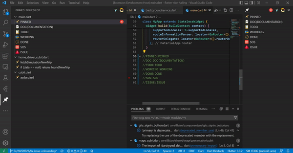

# GITS PINNED

- memudahkan kita untuk marking bagian di code kita untuk jump dari satu marking ke marking yang lain dimana marking disini kita sebut pinned
- memudahkan kita dalam berkolaborasi antar team,karena setiap marking akan terbaca di setiap team yang menginstall extension yang sama maupun tidak
- memudahkan kita untuk documentasi
- mempercepat proses development karena pinned punya beberapa tipe yang bisa di gunakan untuk membuat scope pengerjaan,jadi kita bisa lebih fokus dengan scope tersebut
## ShortCut
- ctrl + p + s (Single pinned inline)
- ctrl + p + m (Change and choose Default  pinned inline)
## Tipe-tipe PINNED
- PINNED
- DOC(DOCUMENTATION)
- TODO
- WORKING
- DONE
- SOS
- ISSUE

## Release Notes

This is First release

### 1.0.0

Initial release of pinned
# Created By uzixCode